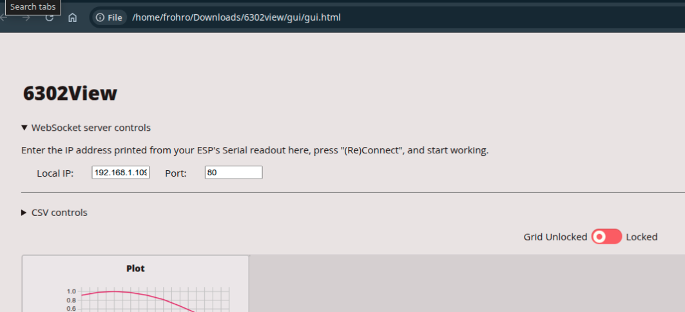

This repository is to help students to use 6302view with the ESP32-C3 super mini.  It can also work for other ESP32 variants with small modifications to the platformio.ini.  The ESP32-C3 has a different type of serial over USB from the regular ESP32 and so it needs these build flags:

    -D ARDUINO_USB_MODE=1

    -D ARDUINO_USB_CDC_ON_BOOT=1

To build using WiFi, you need to have these build flags:

    -DS302_WEBSOCKETS

    -US302_SERIAL

If you want to use the serial connection like I did with the RC circuit, you make them like this by switching which flag is defined and undefined:

    -US302_WEBSOCKETS

    -DS302_SERIAL

Please note that the most recent version of WebSockets will not work until 6302view or WebSockets gets fixed.  It crashes.  Version 2.4.0 works fine.  This probably doesn't effect the guys using serial.  This is fixed in the platformio.ini.  I also made a few minor changes to 6302view and put the forked version on my web site and this repository pulls it from there.  It turns the power down to 8.5 dBm, because without that these super mini boards have a hard time connecting.  The power amplifier is probably distorted at higher power.  

If you use WebSockets, you will need to change the SSID and password of the access point.

You get the IP address and port to put into the gui.html from the serial monitor.  In the monitor, there will be a bunch of debugging info and then this:

> [  1808][D][WiFiGeneric.cpp:1103] _eventCallback(): STA IP: > 192.168.1.109, MASK: 255.255.255.0, GW: 192.168.1.1
> connected!
> --> 192.168.1.109:80 <--

The browser window is setup like this.  Type the address and port in, and hit the connect button.

Of course you will need to replace the PlotExample.cpp with your own code.  I suggest just dragging it to the test directory in VScode and putting your code in a new file in the src directory.  The little -> in the bottom toolbar builds your code.  

I hope this helps!
